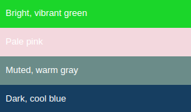
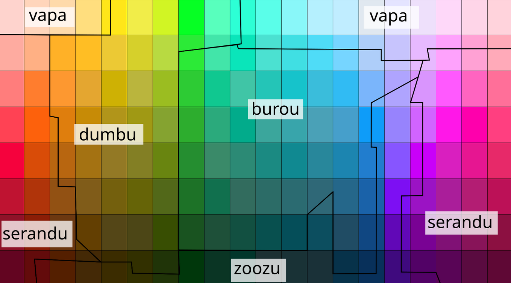
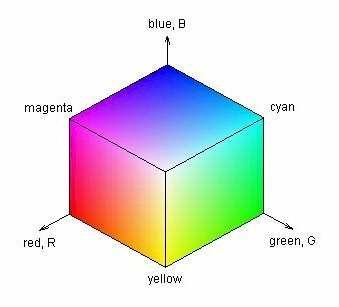
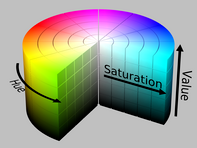
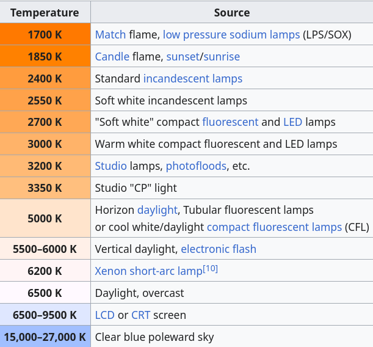

# OVOS Color Parser

> :warning: this package is a work in progress

## What does this have to do with voice?

- "change the lamp color to moss green"
- "make it darker"
- "more saturated"
- "a bit more yellowish"
- "perfect"

> NOTE: physicists are huge nerds, so they might say something like "change the lamp wave lenght to X nanometers", this
> is a terrible way to talk about color and innacurate but we also added basic support for this


## Extracting a color from text

The parser will do it's best to parse "color modifiers"

```python
from ovos_color_parser import color_from_description

names = [
    "Bright, vibrant green",
    "Pale pink",
    "Muted, warm gray",
    "Dark, cool blue",
  
]
for n in names:
    c = color_from_description(n)
    print(c.hex_str)
    print(c)
```


Color names are ambiguous, the same name sometimes refers to multiple colors. When a color is matched by the parser it "averages all matched colors"
```python
from ovos_color_parser import color_from_description

color = color_from_description("Red")
print(color.hex_str)  #D21B1B
print(color) 
# sRGBColor(r=210, g=27, b=27, name='Red', description='Red')
```


We can tell the parser to always return a known/named color with `cast_to_palette=True`, but this might not always return what you expect
```python
from ovos_color_parser import color_from_description

color = color_from_description("Red", cast_to_palette=True)
print(color.hex_str)  #CE202B
print(color)
# sRGBColor(r=206, g=32, b=43, name='Fire engine red', description='Red')
```


### Beware of impossible colors

Some colors are [impossible](https://en.wikipedia.org/wiki/Impossible_color), but that doesn't stop text from describing them

`"Reddish-green"` doesn’t make much sense as a description, unless you mean yellow or orange, which you don’t, because you would have said “yellow” or “orange”. The same applies to `"Yellowish–blue"`

> the Colour of Magic or the King Colour, was the eighth colour of the Discworld spectrum. 
Only visible to wizards and cats. It is described in "The Colour of Magic" as the colour of imagination and is a fluorescent greenish yellow-purple. 
The only time non-wizards can see it is when they close their eyes; the bursts of color are octarine.

<details>
  <summary>Why is this color impossible?</summary>

Fluorescent greenish-yellow and purple are essentially opposite colors on the color wheel, with wavelengths that can’t coexist in a single light wave in the visible spectrum. Here’s why:

1. Color Wavelengths and Light: Greenish-yellow light falls in a wavelength range of about 560–590 nanometers, while purple is not a pure spectral color but a combination of blue (around 450–495 nm) and red (around 620–750 nm). Human eyes perceive purple as a combination of these two ends of the spectrum.
2. Color Opponency Theory: The human visual system relies on color opponency, where certain pairs of colors (like red-green and blue-yellow) are processed in opposing channels. Because of this, our brains can’t interpret colors that simultaneously activate both ends of an opponent channel. This is why we don’t perceive colors like reddish-green or yellowish-blue—our brains are simply wired to cancel out those combinations.
3. Perceptual Limits: Fluorescent colors are especially intense because they emit light in a narrow, concentrated wavelength range, making them appear very saturated and bright. Attempting to mix fluorescent greenish-yellow with purple not only challenges the physiology of the eye but would also result in a muted brown or gray tone, as the colors cancel each other out.

In short, fluorescent greenish-yellow and purple light can’t coexist in a way our eyes can interpret as a single, stable color because of the biological limits of human color perception.
</details>

```python
from ovos_color_parser import color_from_description

# look! an impossible color
color = color_from_description("fluorescent greenish-yellow purple")
color.name = "Octarine"
print(color.hex_str) #76B11D
print(color)
# sRGBColor(r=118, g=177, b=29, name='Octarine', description='fluorescent greenish-yellow purple')
```
the parser will gladly output something... it just might not make sense

in this case the parser focused on `"greenish-yellow"`


but it could have focused on `"purple"`


## Comparing color objects

compare color distances (smaller is better)

```python
from ovos_color_parser import color_distance, color_from_description

color_a = color_from_description("green")
color_b = color_from_description("purple")
print(color_distance(color_a, color_b))
# 64.97192890677195

color_a = color_from_description("green")
color_b = color_from_description("yellow")
print(color_distance(color_a, color_b))
# 44.557493285361

color_a = color_from_description("yellow")
color_b = color_from_description("purple")
print(color_distance(color_a, color_b))
# 78.08287998809946
```

match a color object to a list of colors

```python
from ovos_color_parser import sRGBAColor, sRGBAColorPalette, closest_color

# https://en.wikipedia.org/wiki/Blue-green
BlueGreenPalette = sRGBAColorPalette(colors=[
  sRGBAColor(r=0, g=128, b=128, name="Blue-green"),
  sRGBAColor(r=0, g=255, b=255, name="Cyan (Aqua)", description="Brilliant bluish green"),
  sRGBAColor(r=64, g=224, b=208, name="Turquoise", description="Brilliant bluish green"),
  sRGBAColor(r=17, g=100, b=180, name="Green-blue", description="Strong blue"),
  sRGBAColor(r=57, g=55, b=223, name="Bondi blue"),
  sRGBAColor(r=0, g=165, b=156, name="Blue green (Munsell)", description="Brilliant bluish green"),
  sRGBAColor(r=0, g=123, b=167, name="Cerulean", description="Strong greenish blue"),
  sRGBAColor(r=0, g=63, b=255, name="Cerulean (RGB)", description="Vivid blue"),
  sRGBAColor(r=0, g=128, b=128, name="Teal", description="Moderate bluish green"),
])

print(closest_color(sRGBAColor(r=0, g=0, b=255, name="Blue"),
                    BlueGreenPalette.colors))
# sRGBColor(r=0, g=63, b=255, name='Cerulean (RGB)', description='Vivid blue')
print(closest_color(sRGBAColor(r=0, g=255, b=0, name="Green"),
                    BlueGreenPalette.colors))
# sRGBColor(r=64, g=224, b=208, name='Turquoise', description='Brilliant bluish green')
```

## Color Theory

<details>
  <summary>Color and Language</summary>

Different languages are different names and numbers of colors! color is not universal!

For example, in many languages the colors described in English as "blue" and "green" are colexified, i.e., expressed
using a single umbrella term. To render this ambiguous notion in English, linguists use the blend word grue, from green
and blue

The wikipedia pages
for [Linguistic relativity and the color naming debate](https://en.wikipedia.org/wiki/Linguistic_relativity_and_the_color_naming_debate) , [Blue/Green distinction](Blue–green distinction in language)
and [Color terms](https://en.wikipedia.org/wiki/Color_term) offer a good introduction to this fascinating topic

Colors in language follow a specific evolutionary pattern. This pattern is as follows:

1. All languages contain terms for black and white.
2. If a language contains three terms, then it contains a term for red.
3. If a language contains four terms, then it contains a term for either green or yellow (but not both).
4. If a language contains five terms, then it contains terms for both green and yellow.
5. If a language contains six terms, then it contains a term for blue.
6. If a language contains seven terms, then it contains a term for brown.
7. If a language contains eight or more terms, then it contains terms for purple, pink, orange or gray.

</details>

<details>
  <summary>Color Terms per Language</summary>

In the Bassa language, there are **two terms** for classifying colors; ziza (white, yellow, orange, and red) and hui (
black, violet, blue, and green)

In the Bambara language, there are **three color terms**: dyema (white, beige), blema (reddish, brownish), and fima (
dark green, indigo, and black).

The Ovahimba use **four color names**: zuzu stands for dark shades of blue, red, green, and purple; vapa is white and
some shades of yellow; buru is some shades of green and blue; and dambu is some other shades of green, red, and brown.



English has **11 basic color terms**: black, white, red, green, yellow, blue, brown, orange, pink, purple, and gray;
other languages have between 2 and 12. All other colors are considered by most speakers of that language to be variants
of these basic color terms

Italian, Russian and Hebrew have **twelve basic color terms**, each distinguishing blue and light blue. A Russian will
make the same red/pink and orange/brown distinctions, but will also make a further distinction between синий (sinii) and
голубой (goluboi), which English speakers would call dark and light blue. To Russian speakers, sinii and goluboi are as
separate as red and pink, or orange and brown.

</details>


<details>
  <summary>Color Spaces</summary>

RGB uses additive color mixing, because it describes what kind of light needs to be emitted to produce a given color.
RGB stores individual values for red, green and blue. RGBA is RGB with an additional channel, alpha, to indicate
transparency. Common color spaces based on the RGB model include sRGB, Adobe RGB, ProPhoto RGB, scRGB, and CIE RGB.



CMYK uses subtractive color mixing used in the printing process, because it describes what kind of inks need to be
applied so the light reflected from the substrate and through the inks produces a given color. One starts with a white
substrate (canvas, page, etc.), and uses ink to subtract color from white to create an image. CMYK stores ink values for
cyan, magenta, yellow and black. There are many CMYK color spaces for different sets of inks, substrates, and press
characteristics (which change the dot gain or transfer function for each ink and thus change the appearance).

YIQ was formerly used in NTSC (North America, Japan and elsewhere) television broadcasts for historical reasons. This
system stores a luma value roughly analogous to (and sometimes incorrectly identified as)[9][10] luminance, along with
two chroma values as approximate representations of the relative amounts of blue and red in the color. It is similar to
the YUV scheme used in most video capture systems[11] and in PAL (Australia, Europe, except France, which uses SECAM)
television, except that the YIQ color space is rotated 33° with respect to the YUV color space and the color axes are
swapped. The YDbDr scheme used by SECAM television is rotated in another way.

YPbPr is a scaled version of YUV. It is most commonly seen in its digital form, YCbCr, used widely in video and image
compression schemes such as MPEG and JPEG.

xvYCC is a new international digital video color space standard published by the IEC (IEC 61966-2-4). It is based on the
ITU BT.601 and BT.709 standards but extends the gamut beyond the R/G/B primaries specified in those standards.

HSV (hue, saturation, value), also known as HSB (hue, saturation, brightness) is often used by artists because it is
often more natural to think about a color in terms of hue and saturation than in terms of additive or subtractive color
components. HSV is a transformation of an RGB color space, and its components and colorimetry are relative to the RGB
color space from which it was derived.



HSL (hue, saturation, lightness/luminance), also known as HLS or HSI (hue, saturation, intensity) is quite similar to
HSV, with "lightness" replacing "brightness". The difference is that the brightness of a pure color is equal to the
brightness of white, while the lightness of a pure color is equal to the lightness of a medium gray.

</details>


<details>
  <summary>Conversion Errors</summary>


A color in one absolute color space can be converted into another absolute color space, and back again, in general;
however, some color spaces may have gamut limitations, and converting colors that lie outside that gamut will not
produce correct results. There are also likely to be rounding errors, especially if the popular range of only 256
distinct values per component (8-bit color) is used.

One part of the definition of an absolute color space is the viewing conditions. The same color, viewed under different
natural or artificial lighting conditions, will look different. Those involved professionally with color matching may
use viewing rooms, lit by standardized lighting.

Occasionally, there are precise rules for converting between non-absolute color spaces. For example, HSL and HSV spaces
are defined as mappings of RGB. Both are non-absolute, but the conversion between them should maintain the same color.
However, in general, converting between two non-absolute color spaces (for example, RGB to CMYK) or between absolute and
non-absolute color spaces (for example, RGB to L*a*b*) is almost a meaningless concept.

</details>


<details>
  <summary>Color Names</summary>

A color term (or color name) is a word or phrase that refers to a specific color. The color term may refer to human
perception of that color (which is affected by visual context), or to an underlying physical property (such as a
specific wavelength of visible light).

There are also numerical systems of color specification, referred to as color spaces.

Not all colors have a name, think about a random combination of RGB values, we don't have names for every single hue!


</details>


<details>
  <summary>Color lists</summary>

We expect all computers to represent a color term as the same Hex value, but does this happen in practice? Who names the
colors?

Some standards have been proposed over the years to clearly define colors as a specific number we can represent in a
computer,

- [X11 colors](https://en.wikipedia.org/wiki/X11_color_names) - In computing, on the X Window System, X11 color names
  are represented in a simple text file, which maps certain strings to RGB color values. It was traditionally shipped
  with every X11 installation, hence the name. The web colors list is descended from it but differs for certain color
  names.
- [Web colors standard](https://en.wikipedia.org/wiki/Web_colors) - Web colors are colors used in displaying web pages
  on the World Wide Web; they can be described by way of three methods: a color may be specified as an RGB triplet, in
  hexadecimal format (a hex triplet) or according to its common English name in some case
- [Crayola colors](https://en.wikipedia.org/wiki/List_of_Crayola_crayon_colors) - Since 1903, Crayola has created over
  200 distinct colors for crayons, which often correlate to physical pigments.
- [RAL colors](https://en.wikipedia.org/wiki/List_of_RAL_colours) - Used mainly in Europe, RAL colors are a standard
  color matching system administered by the German organization RAL gGmbH.
- [Traditional colors of Japan](https://en.wikipedia.org/wiki/Traditional_colors_of_Japan) - The traditional colors of
  Japan are a collection of colors traditionally used in Japanese art, literature, textiles such as kimono, and other
  Japanese arts and crafts.
- [XKCD color list](https://xkcd.com/color/rgb/) - The 954 most common RGB monitor colors, as defined by several
  hundred thousand participants in the xkcd color name survey.

Nowadays there are many online projects that attempt to "name every color", anyone can go in there and name a hex value
whatever they want, we are not considering these color names as they have no widespread adoption and are essentiallly a
joke.

</details>


<details>
  <summary>Color Temperature</summary>

As a block of metal heats, its emitted light changes color from red to blue, with each color corresponding to a specific temperature in Kelvin, known as the “Color Temperature.”

For colors based on black-body theory, blue occurs at higher temperatures, whereas red occurs at lower temperatures. This is the opposite of the cultural associations attributed to colors, in which "red" is "hot", and "blue" is "cold".

> **food for thought**: Why are there no green stars?


Warmer colors (2700K–3000K) create a welcoming, relaxed atmosphere ideal for residential, hospitality, and lounge spaces, while cooler colors (4000K and above) provide a clean, focused environment suited for commercial, industrial, and some modern residential areas like kitchens.




</details>

## Language support

When describing color in natural language to approximate it in RGB, there are several keywords that can convey
its properties effectively:

<details>
  <summary>Hue</summary>

- **Description**: Hue refers to the basic color family, such as red, blue, green, or yellow.
- **Translation to RGB**:
    - The hue determines which of the primary RGB channels (red, green, or blue) will be most prominent. For example,
      “red” means a strong red channel with low green and blue, while “blue” means a high blue channel with low red and
      green.
    - Hues like "yellow" indicate both red and green channels are high with blue low, while "purple" combines red and
      blue with little green.
- **Strategy**: Identify the dominant hue, then adjust the RGB channels accordingly to reflect it.

</details>

<details>
  <summary>Saturation (Intensity)</summary>

- **Description**: Saturation, or chroma, is how pure or intense the color is. Terms like “vibrant,” “dull,” or “washed
  out” refer to saturation.
- **Translation to RGB**:
    - High saturation (vibrant): Increase the difference between the dominant channel(s) and others. For example, making
      the red channel much higher than green and blue for a vibrant red.
    - Low saturation (dull): Reduce the contrast between channels, creating a blend closer to grayscale. For instance,
      balancing red, green, and blue channels to similar values lowers saturation.
- **Strategy**: A term like "muted green" would mean lowering the green channel's intensity relative to a bright green,
  but still keeping it dominant over red and blue.

</details>

<details>
  <summary>Brightness (Value or Lightness)</summary>

- **Description**: Brightness refers to how light or dark the color appears. Words like “bright,” “dim,” “dark,” or
  “pale” are often used.
- **Translation to RGB**:
    - High brightness (bright): Increase the values across all channels.
    - Low brightness (dark): Decrease values across channels while maintaining the hue's relative balance.
- **Strategy**: A "pale pink" could be achieved by adding white (higher red, green, and blue values) to lighten a
  typical pink. For a "dark blue," all channels are reduced, but the blue remains higher than the others.

</details>


<details>
  <summary>Temperature (Warmth/Coolness)</summary>

- **Description**: Color temperature reflects whether a color feels warm or cool. Terms like "warm red," "cool green,"
  or "cold blue" apply here.
- **Translation to RGB**:
    - Warm colors: Increase red or red and green channels.
    - Cool colors: Increase blue or decrease red.
- **Strategy**: Adjust the balance between red, green, and blue to match the warmth or coolness described. For example,
  a "warm gray" would have a slight increase in red, while a "cool gray" would have a hint of blue.

</details>

<details>
  <summary>Opacity/Transparency</summary>

- **Description**: Opacity doesn’t affect RGB but is relevant for color perception, especially in design. Terms like
  “translucent,” “opaque,” or “sheer” describe it.
- **Translation to RGB**:
    - Opacity affects the alpha channel (RGBA) rather than RGB values.
- **Strategy**: If opacity is important, adjust the alpha channel rather than RGB. For instance, "translucent blue" with
  an alpha below 1.0 would show a slightly transparent overlay.

</details>

This approach, while interpretative, offers a structured way to translate natural language color descriptions into RGB
approximations.

#### Color Keywords 

To categorize adjectives and keywords that describe color in ways that translate into RGB or color space adjustments the
parser uses a `.json` file per language

Color name lists in each language are also used to determine the **hue**. 

> English has a word list of almost ~6000 color name mappings

Below are some examples of non-color-name keywords that define other qualities of a color

<details>
  <summary>Saturation (Intensity)</summary>

- **Very High Saturation**: For colors that are extremely intense or vivid.
    - Keywords: “neon,” “saturated,” “intense,” “brilliant,” “flamboyant”
- **High Saturation**: These adjectives indicate vibrant or intense colors where the hue is pronounced.
    - Keywords: “vibrant,” “rich,” “bold,” “deep,” “vivid,” “intense,” “pure,” “electric”
- **Low Saturation**: These adjectives imply a muted or washed-out appearance, often making the color appear closer to
  grayscale.
    - Keywords: “dull,” “muted,” “washed-out,” “faded,” “soft,” “pale,” “subdued,” “pastel”
- **Very Low Saturation**: For colors that are very desaturated, nearing grayscale.
    - Keywords: “drab,” “grayed,” “washed-out,” “faded,” “subdued”
</details>

<details>
  <summary>Brightness (Lightness/Value)</summary>

- **Very High Brightness**: Extremely bright colors, often implying high lightness or near-whiteness.
    - Keywords: “blinding,” “radiant,” “glowing,” “white,” “light-filled”
- **High Brightness**: Bright colors, often indicating a lighter shade or close to white.
    - Keywords: “bright,” “light,” “pale,” “glowing,” “luminous,” “brilliant,” “clear,” “radiant”
- **Low Brightness**: These terms describe darker or dimmer shades, closer to black.
    - Keywords: “dim,” “dark,” “shadowy,” “faint,” “gloomy,” “subdued,” “deep,” “midnight”
- **Very Low Brightness**: Colors that are nearly black or very dark.
    - Keywords: “pitch-dark,” “black,” “shadowed,” “deep,” “ink-like”

</details>

<details>
  <summary>Temperature (Warmth)</summary>

- **Very High Temperature (Very Warm)**: Intense warm colors, strongly leaning toward red, orange, or intense yellow.
    - Keywords: “fiery,” “lava-like,” “burning,” “blazing”
- **High Temperature (Warm Colors)**: Warmer colors suggest a shift towards red or yellow tones, giving the color a
  warmer feel.
    - Keywords: “warm,” “hot,” “fiery,” “sunny,” “toasty,” “scorching,” “amber,” “reddish”
- **Low Temperature (Cool Colors)**: Cooler colors involve blue or green tones, giving the color a cooler or icy
  appearance.
    - Keywords: “cool,” “cold,” “chilly,” “icy,” “frosty,” “crisp,” “bluish,” “aqua”
- **Very Low Temperature (Very Cool)**: Extremely cool tones, verging on cold, icy blues or greens.
    - Keywords: “icy,” “arctic,” “frigid,” “wintry,” “glacial”
</details>

<details>
  <summary>Opacity/Transparency</summary>


- **Very High Opacity**: Extremely solid or dense colors.
    - Keywords: “impenetrable,” “opaque,” “thick”
- **High Opacity**: Describes solid colors without transparency.
    - Keywords: “opaque,” “solid,” “dense,” “thick,” “cloudy,” “impenetrable,” “strong”
- **Low Opacity**: Indicates transparency or translucency, where the background may show through.
    - Keywords: “transparent,” “translucent,” “sheer,” “see-through,” “misty,” “delicate,” “airy”
- **Very Low Opacity**: Highly transparent or barely visible colors.
    - Keywords: “ethereal,” “ghostly,” “barely-there,” “translucent”

</details>


## Related Projects

- [ovos-number-parser](https://github.com/OpenVoiceOS/ovos-number-parser) - for handling numbers
- [ovos-date-parser](https://github.com/OpenVoiceOS/ovos-date-parser) - for handling dates and times
- [ovos-lang-parser](https://github.com/OVOSHatchery/ovos-lang-parser) - for handling languages
